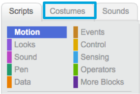
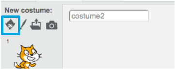

1. So your cat moves up and down, as well as left to right. You should probably put it somewhere sensible for that... like under water! Scratch has a library of backgrounds and sprites for you to use to make your project look awesome.
 * Select the stage
 * Click on **Backdrops** 
 * Click the icon to "Choose backdrop from library" 
 Then pick your favourite underwater background!

2. Great! Of course, now you have a cat underwater. Cats aren’t usually big fans of that, but you can fix that. You can turn the cat into a shark!

 First, select the cat and click on the **Costumes** tab 

3. Then, click on **Choose Costume from Library** 

4. Pick this shark 

5. Now remove the cat costumes by selecting each of them and clicking on the **x** 

 Now you have a shark!