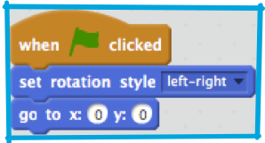

1. Теперь у тебя есть акула, чтобы рассекать в воде. Класс! Пора ей добавить рыбок для ловли!

   Кликни на кнопку **new sprite** / новый персонаж(объект) и затем выбери рыбку из открывающегося окна. 

   А рыбка-то большевата для твоей акулы. Используй **grow** (увеличивать, растить) и **shrink** (уменьшать, усаживаться(как вы стирке)), чтобы сделать рыбку подходящего размера. 

   Щелкай на **grow** или **shrink**, а затем кликай на рыбу, чтобы увеличивать или уменьшать ее.

2. Отлично! Позднее ты можешь дописать код, чтобы рыбка плавала сама по себе без помощи игрока. А твоим игроком будет акула, пытающаяся поймать себе обед.

   Так или иначе, но то что акула плавает задом на перед, выглядит странновато. Точно так же как ты, обычно разворачиваешься, чтобы пойти назад, акула должна развернуться и тогда плыть в другом направлении. Ага! Большая удача — у Scratch есть блок кодов для этого!

   Выбираем направление для твоего персонажа\sprite в направление\ **point in direction** блоке кодов. Ты можешь вводить любые значения, главные 4, которые тебе будут необходимы уже здесь: **up** / вверх, **down** / вниз, **left** / лево и **right** / право. Ты найдешь их в секции блоков motions\ движения. Хватай парочку их и тащи в код своей акулы, вот так: 

 * Change the -10 to 10, the shark is just swimming forward now

3. If you tried moving the shark around after you added the `“point in direction”` blocks, you might have noticed something a little strange happening. The shark may not be turning quite right! 

 The problem here is that the shark sprite started, as all sprites do, with the `“all around”` **rotation style**, and what you need it to have is the **left-right** style.

 As usual, there’s a block for that and it’s in **motion**! You just need to update your reset code from Card 3 to set the rotation style to "left-right", like this: 
