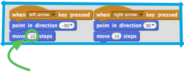

1. Теперь у тебя есть акула, чтобы рассекать в воде. Класс! Пора ей добавить рыбок для ловли!

   Кликни на кнопку **new sprite** / новый персонаж(объект) и затем выбери рыбку из открывающегося окна. 

   А рыбка-то большевата для твоей акулы. Используй **grow** (увеличивать, растить) и **shrink** (уменьшать, усаживаться(как вы стирке)), чтобы сделать рыбку подходящего размера. 

   Щелкай на **grow** или **shrink**, а затем кликай на рыбу, чтобы увеличивать или уменьшать ее.

2. Nice! Later, you're going to add some code to make the fish move around on its own, without help from the player. Your player will be the shark, trying to catch the fish.

 However, it does look a little funny to have that shark swimming backwards. Just like you’d usually turn around rather than walking backwards, the shark would turn around rather than swimming that way. Luckily for you, Scratch has a block for this!

 The `**point in direction**` block lets you pick the direction your sprite is pointing in. You can type in any number, but it comes with the four you'll need most already in there: **up**, **down**, **left** and **right**. You’ll find it in the **motion** blocks section. Grab it and snap a couple of them into your shark’s code, like this: 

 * Change the -10 to 10, the shark is just swimming forward now

3. If you tried moving the shark around after you added the `“point in direction”` blocks, you might have noticed something a little strange happening. The shark may not be turning quite right! 

 The problem here is that the shark sprite started, as all sprites do, with the `“all around”` **rotation style**, and what you need it to have is the **left-right** style.

 As usual, there’s a block for that and it’s in **motion**! You just need to update your reset code from Card 3 to set the rotation style to "left-right", like this: 
