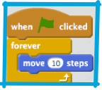
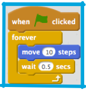
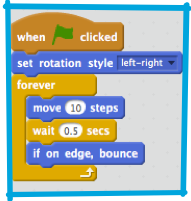
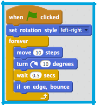
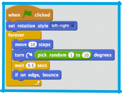

1. ОК, пора отпустить рыбку плавать самой по себе. Для того чтобы это получилось, тебе нужен новый вид блоков: **control** / контроль. Они тебе позволят задавать количество определенных действий, в определенных условиях.
Выбери sprite рыбки, притащи из **event** / события блоков `”when green flag clicked”` -  «когда клик по зеленому флагу» , и `”forever”` (навсегда, бесконечно) из блоков контроля/control, и еще `”move 10 steps”` (переместить на 10 шагов) из блоков **motion** / движения на **sprite panel** / панель объектов, вот так:
 

  Так, рыбка будет повторять что-то с командой `”forever”` блока бесконечно. Как только будет достигнут конец, она вернется в верх к началу блока и снова начнет повторять. Теперь кликни на зеленый флаг и посмотри, что произойдет!

2. Итак, эта рыбка бьется о края **stage** / сцены, и двигается слишком быстро, чтобы твоя акула смогла ее поймать. Первое, рыбку надо замедлить. Это, на самом деле, очень просто, нужно, чтобы она подождала, прежде чем продвинулась на следующие 10 шагов.

   В блоках **control** / контроля бери этот:
 

   Можешь установить сколько **seconds** / секунд ты хочешь, чтобы рыбка подождала. Сейчас попробуй установить полсекунды (0.5).  Теперь ты можешь задавать разные значения задержки, чтобы подобрать подходящие для игры. Помни, что ты можешь поменять значения количества шагов тоже!
 

3. Хорошо, рыбка двигается,  но нужно, чтобы она отскакивала от краев. Да, снова, в блоки **motions** / движения за нужным блоком! Это блок `”if touching edge bounce”` / «при соприкосновении с краем отскакивать». Этот блок следит  касается ли sprite(за рыбка) края, и если да, то развернет ее налево, вправо, вверх или вниз, как задано. Конечно, это приведет к тому, что рыбка перевернется брюхом вверх, поэтому тебе надо будет установить значения поворотов `”set rotation style”` снова. 

4. Итак, рыбка плавает вперед и назад, но только по прямой. Это будет слишком просто и неинтересно для игрока с акулой. Тебе нужно сделать так, чтобы рыбка двигалась хаотически.

   С 2й Суши-карточкой, ты уже научился, как поворачивать sprite, вот, начинаем отсюда: притащи блок ”turn” (поворот) в коды рыбки и кликни зеленый флаг.
 

5. It’s better, but there’s still too much of a pattern. It needs to be more random. Luckily, Scratch can do random for you! You’ll just need a new kind of block, called an **operator** block.

 **Operators** take in one or more values (numbers, text, true/false values) and give back a single value. You can tell the kind of value it will give back by the shape of the block: round ends give numbers or text, pointy ends give true/false. 

 You need the `"pick random"` **operator** block, and you need to plug it into the `“turn degrees”` **motion** block by clicking and dragging it into the field where you set the number of degrees. You can change the minimum and maximum numbers it will pick, but the default values (1 and 10) are pretty good for this game, so you can just leave them.

 Update the fish code to this and then run it by clicking the green flag: 
 
 **Next: Catching that fish!**

