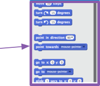

1. Great! You’ve written your first Scratch program. Time to learn a little more about gettng code in and out of Scratch! Scratch code is made up of **blocks** that you snap together to make programs. ![])(assets/code1.png)

 These blocks come from the **Code Blocks Pallet** where they are broken up into different categories. By clicking on the category names, you can see the blocks in that category. Here, the **motion** category is selected. 

 All of the blocks in the selected category are shown in a list. You can pick the one you want, click on it and hold down the mouse button, then just drag it onto the **current sprite panel** and let go. 

2. Once the block is in the **current sprite pane** you can move it around and snap it to other blocks. If you want to see what a block does, you can double-click on it and it will run!

 Normally, you want your blocks to run automatically, when something happens. This is why most of your programs will start with a block from the **events** category. Most often, it will be this one: 

 * The code blocks connected to this block will run after the **green flag** is clicked

3. Code blocks run from top to bottom, so the order you snap your code together in matters.
In this example, the sprite will **say** “Hello!” before it will **play** the *meow* sound. 

4. Removing, or deleting, code blocks you don’t want in your program is easy! You just have to click on the **scissors** icon and then click on the code you want to remove. 

 Be careful though! **You will delete all the blocks connected to the one you click on**.
 
 If you do this by accident and want to get your code back, you can use the `**edit**` menu and click on `**undelete**`. Try adding, deleting, and undeleting some code blocks now! 

5. Now you know how to move code around and make things happen, time to try a simple program: Making the Scratch Cat walk in a circle!

 Make sure you have the cat selected in the sprite list and then drag these blocks together. You’ll find them in **events** and **motion**. 

 Then, click on the green flag above the **stage**. If you click too many times and the cat walks away, you can drag it back! 

 That’s a cat walking in a straight line... not exactly what you want. Snap this block to the end to make it walk in a circle. It’s in **motion** too. 

 * This block makes the cat turn 15 degrees of the full 360 degrees that make up a circle. You can change that number, and the number of steps, by clicking on the number and typing a new value.

6. Now save your work! You do this by going to the `**file**` menu and clicking `**save**`. 

 Remember to save regularly as you work!

 You can also use `**save as**` to save a copy of your program with a new name.
