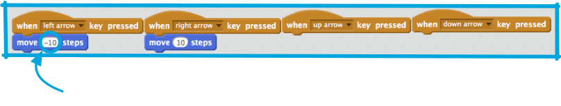
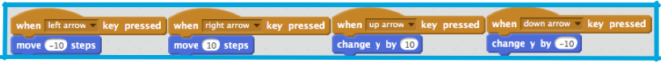

1. Twój kot już się rusza, ale czy nie ciekwiej byłoby go kontrolować przy pomocy strzałek? Dzięki tej karcie dowiesz się jak to zrobić w Scratchu!

   Jak łatwo zgadnąć, znowu będą potrzebne bloki kodu z kategorii **Zdarzenia** oraz **Ruch**! Poszukaj takiego bloku: 

   Gdy klikniesz niewielką strzałkę (▼) obok napisu „spacja” rozwinie Ci się lista wszystkich klawiszy jakich możesz użyć. Będziesz potrzebować 4 takich bloków, do których podłączysz klawisze z kategorii **Ruch** w taki sposób: 

 * do obsługi strzałek, będą Ci potrzebne 4 bloki zdarzeń po jednym dla:
     * „strzałka w górę”
     * „strzałka w prawo”
     * „strzałka w dół”
     * „strzałka w lewo”
 * -10 oznacza: **idź 10 kroków w tył**

2. Twój kot już potrafi chodzić w przód i w tył, co jest już całkiem fajne, ale nie umie się jeszcze poruszać do dołu, ani do góry. Ponadto, gdy przyjżysz się blokom w kategorii **Ruch**, nie zobaczysz tam bloków dla „góry”, ani „dołu”. Jest tam za to sporo bloków odnoszących się do **x** i **y**…

   Gdy programiści umieszczają jakieś obiekty w przestrzeni, np. duszki na scenie, często do podania pozycji posługują się współrzędnymi **x** i **y**.  

   **Oś x** przebiega od lewej do prawej, a **oś y** od dołu do góry. 

   Duszek może być ustawiony na scenie przez podanie współrzędnych jego środka, pisząc np. (15, -27) wskazujemy, że 15 jest pozycją **x**, a -27 pozycją **y**.

   Żeby lepiej zrozumieć jak to działa, przeciągnij blok **idź do** z kategorii **Ruch** na **obszar roboczy** (nie musisz go z niczym łączyć). 

   Następnie, zmień wartości **x** oraz **y** i _podwójnie kliknij ten blok_.  Popróbuj z różnymi wartociami i obserwuj dokąd „przechodzi” kot!
   Wartości dostępne dla **x** są w przedziale od -240 do 240, a dla  **y** w przedziale od -180 do 180.

3. Teraz, gdy wiesz jak korzystać ze współrzędnych **x** i **y** możesz poruszać kotem w górę i w dół. Wystarczy tylko zmieniać wartość współrzędnej **y**. Dodaj do swojego kodu takie bloki: 

   Po naciśnięciu strzałek, kot powinen się teraz poruszać we wszystkich 4 kierunkach!

4. Twój kot porusza się po całym ekranie, ale wyobraź sobie, że to gra — jak ją zrestartować? Gdy gracz rozpoczyna grę, należy przestawić kota do jego startowej pozycji. W Scratchu grę rozpoczyna się przez wciśnięcie zielonej flagi, więc gdy to nastąpi musisz zmienić współrzędne **x** i **y* swojego kota.

   Jest to całkiem proste do zrobienia! Środek sceny ma współrzędne (0,0), tak więc wszystko co trzeba zrobić, to dodać z kategorii **Zdarzenia** blok, który jest uruchamiany po wciśnięciu zielonej flagi oraz blok **idź do**, który już masz w obszarze roboczym. Ustaw **idź do** na (0,0) i dołącz go do bloku zdarzeniowego. 
