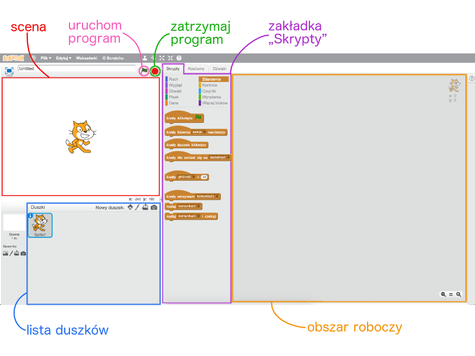
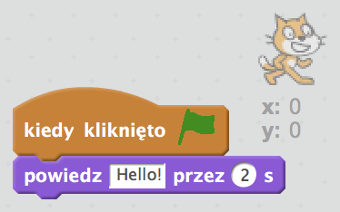

1. Celem tej Karty Sushi jest nauczenie Cię tworzenia programów w Scratchu. Żeby się tego nauczyć w pierwszej kolejności musisz uruchomić **Scratcha.**

   Scratcha można pobrać ze strony [dojo.soy/downloadscratch](dojo.soy/downloadscratch) i zainstalować  na swoim komputerze, albo uruchomić w przeglądarce wchodząc na stronę: [dojo.soy/usescratch](dojo.soy/usescratch). Gdy już zdecydujesz w jaki sposób go uruchomić przejdź do następnego kroku.

2. Wersji przeglądarkowa będzie wymagać rejestracji, a desktopowa instalacji. Kiedy wykonasz te kroki, pokaże Ci się obszar roboczy.  
   Obszar ten jest podzielony na kilka istotnych częśći, których nazwy warto zapamiętać. Są one oznaczone na poniższym obrazku  
   

3. Kilka dodatkowych informacji nt. elementów okna:

   * **Scena**
     To tu widać efekty działania Twojego programu. Scena zbudowana jest z: 
     * co najmniej jednego **tła** \(obrazków będących tłem na ekranie\)
     * **bloków kodu**, które np. mogą tę scenę zmieniać \(omówimy to w dalszej części\)

   * **Duszki**
     Każdy obiekt występujący na scenie jest duszkiem, który może mieć następujące cechy:
     * **obrazek**
        
     * dodatkowe **kostiumy** \(wygląd\)
     * **dźwięki** przypisane do duszka
     * **bloki kodu** 
     **Bieżącym duszkiem** jest ten, który jest zaznaczony na **liście duszków**.

   * **Bloki kodu**  
     Kod w Scratchu tworzą bloki, które łączy się,  tak aby zbudować z nich program. Bloki wybiera się z zakładki **Skrypty** i przeciąga na **obszar roboczy** bieżącego duszka łącząc z innymi blokami.

     W zakładce **Skrypty** jest 10 kategorii bloków oznaczonych różnymi kolorami. Gdy wybierzesz jakąś kategorię na liście pod nią pokażą Ci się dostępne w niej bloki.

4. Czas coś wreszcie stworzyć! Otwórz okno ze Scratchem i kliknij na Kocie znajdującym się na liście duszków. W ten sposób kot stał się Twoim bieżącym duszkiem.

   Wybierz kategorię **Zdarzenia** w zakładce **Skrypty** i przeciągnij z listy poniżej zdarzenie `“kiedy kliknięto [zieloną flagę]”` na **bieżący obszar roboczy**.

   Następnie wybierz z zakładki **Skrypty** kategorię **Wygląd** i z listy poniżej przeciągnij blok `“powiedz [Hello!] przez [2] s”` na **biezący obszar roboczy** dołączając go do spodu poprzednio umieszczonego bloku w taki sposób: 

Teraz naciśnij przycisk **Uruchom program** i obserwuj co się stanie na **scenie**!

