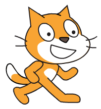

1. Celem tej Karty Sushi jest nauczenie Cię tworzenia programów w Scratchu. Żeby się tego nauczyć w pierwszej kolejności musisz uruchomić **Scratcha.**

   Scratcha można pobrać ze strony [dojo.soy/downloadscratch](dojo.soy/downloadscratch) i zainstalować  na swoim komputerze, albo uruchomić w przeglądarce wchodząc na stronę: [dojo.soy/usescratch](dojo.soy/usescratch). Gdy już zdecydujesz w jaki sposób go uruchomić przejdź do następnego kroku.

2. Wersji przeglądarkowa będzie wymagać rejestracji, a desktopowa instalacji. Kiedy wykonasz te kroki, pokaże Ci się obszar roboczy.
   Obszar ten jest podzielony na kilka istotnych częśći, których nazwy warto zapamiętać. Są one oznaczone na poniższym obrazku              

   

* Scena
* Uruchom Progam
* Zatrzymaj Program
* Start Program
* Stop Program
* Obszar Roboczy Duszka
* Sprite List
* Code Blocks Pallette

3. There are a few words from that picture that need explaining:

    **The Stage**

    This is where your Scratch Programs run. It has

    * One or more **backgrounds** \(images on the background of the screen\)
    * Any **code blocks** associated with it \(we’ll get to this\)
      **Sprites**

    Any object that goes on the stage is a sprite.  
    In Scratch, the sprite is:

    * The **image** on the stage
    * Any alternative **costumes** \(looks\) it has
    * Any **sounds** associated with it
    * Any **code blocks** associated with it 

    The **current sprite** is the one that's selected in the **sprite list**.

    **Code Blocks**

    Code in Scratch comes as blocks, that you click together to make programs. You choose blocks from the **code blocks palette** and drag them into the **current sprite panel**, then click them together.  
    There are 10 categories of blocks, which are colour coded, and you can select each category from the list at the top of the **code blocks palette**.

4. Time to get coding! Go back to Scratch and click on the Scratch Cat in the sprite list. The cat is now the current sprite.  
    Go to the **Events** category in the **code blocks palette** and choose the `“when [flag symbol] clicked”` event, then drag it onto the **current sprite panel**.  
    Then go to **Looks** in the **code blocks palette** and choose the `“say [Hello!] for [2] secs”` block and drag it onto the **current sprite panel**, connecting it to the end of the other block, like this: 

    Now click the **Start Program** button and watch what happens!

