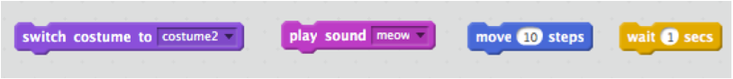
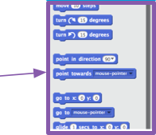

1. Великолепно! Ты написал(а) свою первую программку в Scratch. Пора еще кое что узнать о том что можно делать с кодами в Scratch! Scratch код специально создан из **блоков**, чтобы тебе было просто их соединять в свою программу. 

  Блоки собраны в **Code Blocks Palette/ Палитре блоков кодов** по разным категориям. Кликая на название категории, ты можешь увидеть какие блоки она содержит. Здесь, выбрана категория **motions/движения**. 

   Все блоки в выбранной категории показаны списком. Ты можешь выбрать тот блок, который тебе нужен, захватить мышкой и просто перетащить на **Current Sprite Panel/Панель Выбранного Объекта** и отпустить. 

2. Как только блок оказывается на **Current Sprite Panel/Панель Выбранного Объекта** ты можешь его перемещать как угодно, присоединять к другим блокам. Если ты хочешь посмотреть, что этот блок делает то кликни дважды по нему и ты его запустишь!

   Обычно, хочется, чтобы блоки запускались автоматически, когда что-то происходит (например, после щечка мышью кот Scratch начинает шагать). Поэтому большинство твоих программ будет начинаться с блоков из категории **событие/events**. Чаще всего будет использоваться вот этот: 

 * Блоки кодов связанные с этим блоком запустятся после того, как нажмешь на **зеленый флажок**.

3. Коды блоков запускаются сверху вниз, так что имеет значение в каком порядке ты их составляешь.

   В этом примере, объект/sprite **скажет** ”Hello!” перед тем как проиграет звук «мяу». 

4. даление блоков, которые не нужны в твоей программе, тоже просто! Просто нажми на иконку **Ножницы/Scissors**, а потом кликни на код, который хочешь убрать. 

   Внимательно и осторожно! **Ты удалишь все блоки, которые Соединенны!**
 
   Если случайно это все же произошло, и ты хочешь вернуть цепочку своих кодов, то можешь зайти в меню `**Правка/Edit**` и выбрать там `**Восстановить/Undelete**`. Теперь пробуй добавлять, удалять и восстанавливать блоки кодов! 

5. Теперь ты знаешь как перемещать коды и создавать события, так что пора попробовать написать простую программку: Заставим Кота Scratch ходить по кругу!

   Убедись, что Кот Scratch выбран в Sprite List/Списке Объектов и начинай перетаскивать блоки друг к другу. Ты найдешь их в **Events/События** и в **Motions/Движения**. 

  Потом кликни на иконку зеленого флажка над **Сценой/Stage**. Если ты кликнул(а) несколько раз и кот ушел, его можно вернуть обратно на сцену. 

  Этот кот ходит по прямой...не то что мы хотим. Перемести этот блок в конец, чтобы кот пошел по кругу. Он тоже в **Motions/Движениях**. 

 * А этот блок заставляет кота поворачиваться на 15 градусов от полных 360, которые составляют полный круг. Ты можешь изменить эту цифру, можешь изменить количество шагов, кликая на окошко и вводя свои цифры.

6. Ну, все! Пора сохранить свою работу! Заходи в меню `**file**` и нажимай `**save**`/сохранить. 

   Не забывай регулярно сохраняться!

   Ты можешь также использовать `**save as**` чтобы сохранить копию своей программы с другим именем файла. 
