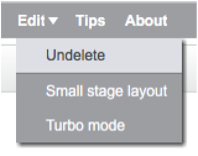

1. Великолепно! Ты написал(а) свою первую программку в Scratch. Пора еще кое что узнать о том что можно делать с кодами в Scratch! Scratch код специально создан из **блоков**, чтобы тебе было просто их соединять в свою программу. 

  Блоки собраны в **Code Blocks Palette/ Палитре блоков кодов** по разным категориям. Кликая на название категории, ты можешь увидеть какие блоки она содержит. Здесь, выбрана категория **motions/движения**. 

   Все блоки в выбранной категории показаны списком. Ты можешь выбрать тот блок, который тебе нужен, захватить мышкой и просто перетащить на **Current Sprite Panel/Панель Выбранного Объекта** и отпустить. 

2. Как только блок оказывается на **Current Sprite Panel/Панель Выбранного Объекта** ты можешь его перемещать как угодно, присоединять к другим блокам. Если ты хочешь посмотреть, что этот блок делает то кликни дважды по нему и ты его запустишь!

   Обычно, хочется, чтобы блоки запускались автоматически, когда что-то происходит (например, после щечка мышью кот Scratch начинает шагать). Поэтому большинство твоих программ будет начинаться с блоков из категории **событие/events**. Чаще всего будет использоваться вот этот: 

 * Блоки кодов связанные с этим блоком запустятся после того, как нажмешь на **зеленый флажок**.

3. Code blocks run from top to bottom, so the order you snap your code together in matters.
In this example, the sprite will **say** “Hello!” before it will **play** the *meow* sound. 

4. Removing, or deleting, code blocks you don’t want in your program is easy! You just have to click on the **scissors** icon and then click on the code you want to remove. 

 Be careful though! **You will delete all the blocks connected to the one you click on**.
 
 If you do this by accident and want to get your code back, you can use the `**edit**` menu and click on `**undelete**`. Try adding, deleting, and undeleting some code blocks now! 

5. Now you know how to move code around and make things happen, time to try a simple program: Making the Scratch Cat walk in a circle!

   Убедись, что Кот Scratch выбран в Sprite List/Списке Объектов и начинай перетаскивать блоки друг к другу. Ты найдешь их в **Events/События** и в **Motions/Движения**. 

  Потом кликни на иконку зеленого флажка над **Сценой/Stage**. Если ты кликнул(а) несколько раз и кот ушел, его можно вернуть обратно на сцену. 

  Этот кот ходит по прямой...не то что мы хотим. Перемести этот блок в конец, чтобы кот пошел по кругу. Он тоже в **Motions/Движениях**. 

 * А этот блок заставляет кота поворачиваться на 15 градусов от полных 360, которые составляют полный круг. Ты можешь изменить эту цифру, можешь изменить количество шагов, кликая на окошко и вводя свои цифры.

6. Ну, все! Пора сохранить свою работу! Заходи в меню `**file**` и нажимай `**save**`/сохранить. 

   Не забывай регулярно сохраняться!

   Ты можешь также использовать `**save as**` чтобы сохранить копию своей программы с другим именем файла. 
