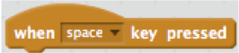
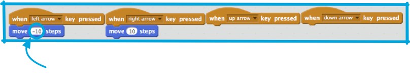
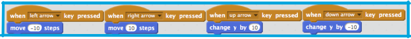

1. Так, теперь твой скратч кот двигается, но разве не было бы прикольней контролировать его стрелками передвижения? С помощью этой карточки ты научишься и этому!

   Как ты, можешь предположить, тебе снова потребуются блоки из **Events/События** и **Motions/Движения**. В этот раз тебе нужно найти этот блок: 

   Если ты нажмешь на маленькую стрелочку \(▼\) слева от ”space”(пробел, промежуток, пространство), ты увидишь все клавиши своей клавиатуры, чтобы выбрать из них подходящие. Тебе нужны вот эти 4 блока и ты можешь присоединить их к блокам **Motions/Движения** вот так: 

   * The four blocks you'll need are for "left arrow", "right arrow", "up arrow" and "down arrow"
   * -10 означает
сделать: **10 шагов назад
**

1. Твой кот двигается вперед и назад — это круто! Но еще не вверх и вниз. Да, когда ты просмотришь все блоки в **Motions/Движения**, то не найдешь блоков ”up” \(вверх\) или ”down” \(вниз\). Это потому, что все они связаны с **х** \(горизонталью\) и **у** \(вертикалью\) по оси координат...

   Когда программистам нужно указать позицию объекта, как sprite, мы часто используем координаты **х** и **у**, чтобы указать местоположение объекта. **X-ось** идет с лева на право, а **у-ось** с верху в низ.
 

   Положение sprite  отсчитывается от его центра, и запись как \(15, -27\), где 15  - это **х**, т. е. по горизонтали, а -27 это **у**, т. е. по вертикали.

   Чтобы наглядно увидеть, как это работает, возьмем блок `**go to**` \(двигаться в направлении\) из  **Motions/Движения** и положим на **Current Sprite Panel/Панель Выбранного Объекта**. Его не надо присоединять к другим блокам.

   Следующее: выбери любые значения **х** и **у**, вбей их, и дважды кликни по блоку. Попробуй задавать разные значения и смотри куда кот передвинется! В Scratch значения по **х** могут быть от -240 до 240, а по **у** от -180 до 180.

1. Теперь ты знаешь о координатах **х** и **у**, и можешь перемещать кота вверх и вниз! Тебе просто нужно менять значения **у**. Ты можешь улучшить свой код вот так: 

   Ура! Теперь, когда ты нажимаешь клавиши со стрелками, кот передвигается по сцене!

2. Кот перемещается везде по экрану, но представь себе, что это все игра: Как ее перезапустить? Тебе нужно, чтобы кот оказался на месте старта, откуда и начинается игра. В Scratch старт игры начинается по щелчку на зеленый флаг, значит тебе надо изменить **х** и **у** координаты кота, когда это случается.

   На самом деле, это очень просто! Центр сцены это \(0, 0\) **х** и **у** по оси координат. Все что тебе понадобится это из  **Events/События** блок с зеленым флагом и **go to** блок, который ты уже используешь. Установи значения `**go to**` на 

