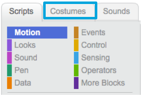
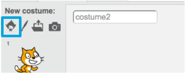

1. Итак, твой кот двигается в верх и вниз, а также с лева на право. Хорошо бы было поместить его в подходящую обстановку, например... под водой! В Scratch есть библиотека backgrounds (фонов) и sprites(персонажей), чтобы ты мог сделать свой проект по настоящему крутым.

  * Выбери stage (сцену)
  * Кликни на меню **Backdrops**(декорации, задник сцены) 
  * Кликни сюда 
И выбери понравившийся тебе background подводного мира!

2. Здорово! Теперь кот в подводном мире. Но кошки, на самом деле, отнюдь не фанаты воды, и ты можешь это изменить. Давай-ка трансформируем кота в акулу!

   Сначала выбери кота и кликни на вкладку **Costumes** / Костюмы 

3. Потом, щелкни на **Choose Costume from Library** / Выбрать Костюм из Библиотеки 

4. Выбери эту акулу 

5. Затем удали костюмы, выбирая каждый из них и нажимая на **x** 

Нажми сюда
Теперь у тебя акула!