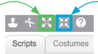
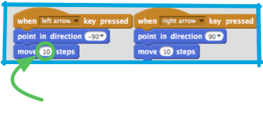
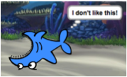

1. Теперь у тебя есть акула, чтобы рассекать в воде. Класс! Пора ей добавить рыбок для ловли!

   Кликни на кнопку **new sprite** / новый персонаж(объект) и затем выбери рыбку из открывающегося окна. 

   А рыбка-то большевата для твоей акулы. Используй **grow** (увеличивать, растить) и **shrink** (уменьшать, усаживаться(как вы стирке)), чтобы сделать рыбку подходящего размера. 

   Щелкай на **grow** или **shrink**, а затем кликай на рыбу, чтобы увеличивать или уменьшать ее.

2. Отлично! Позднее ты можешь дописать код, чтобы рыбка плавала сама по себе без помощи игрока. А твоим игроком будет акула, пытающаяся поймать себе обед.

   Так или иначе, но то что акула плавает задом на перед, выглядит странновато. Точно так же как ты, обычно разворачиваешься, чтобы пойти назад, акула должна развернуться и тогда плыть в другом направлении. Ага! Большая удача — у Scratch есть блок кодов для этого!

   Выбираем направление для твоего персонажа / sprite в направление `"point in direction"` блоке кодов. Ты можешь вводить любые значения, главные 4, которые тебе будут необходимы уже здесь: **up** / вверх, **down** / вниз, **left** / лево и **right** / право. Ты найдешь их в секции блоков motions\ движения. Хватай парочку их и тащи в код своей акулы, вот так: 

 * измени -10 на 10, и акула плывет вперед
 
3. Если ты пробовал передвигать акулу используя блок `"point in direction"` / направление, ты, наверное, заметил, что что-то не так. Акула-то поворачивает, но не совсем правильно! 

   Проблема в том, что у sprite акулы, как и у всех sprites, изначально опция `"all around"` (везде вокруг) **rotation style** (стиль вращения), но тебе то нужен стиль **left-right** слева-направо.

   Как обычно, этот блок находится в **motions** / движения! Тебе только нужно обновить твой код с карточки № 3 и установить стиль движения вот так: 