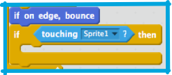
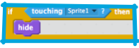
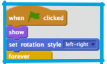
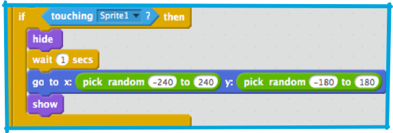
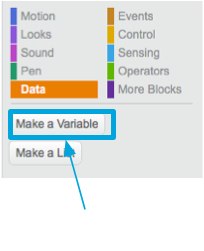
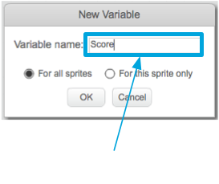
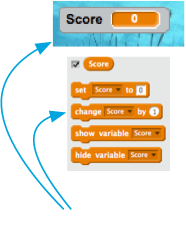

1. Акула движется, рыбка плавает, но они не взаимодействуют: если рыбка плывет прямо в пасть акуле, ничего не происходит. Пора это изменить!

   Во-первых, тебе нужно знать, когда рыбка касается пасти акулы. Для этого тебе нужен **control** блок и  блок **sensing / ощущений**. **Sensing** блоки собирают информацию, такую как где находится sprite, что его касается и пр.

   Блоку **control** `"if...then"` \(«если что-то..., тогда то-то..»\) нужно задавать значения true/false. В **sensing** блоке тебе понадобится использовать `"touching"` / (касание, прикосновение\), где ты должен выбрать кликом имя sprite \(если ты не поменял его имя, то по умолчанию он — Sprite1\). Вот в этом прямоугольнике с острыми концами ты можешь задать true/false value для `”if...then"`.
   
   Ты можешь добавить этот блок в `"forever"` цикл рыбки, сразу после `”if on edge bounce”`:
 

2. Конечно,  ты добавил блок  `"if...then"`, но без тогда то-то. Ты можешь заставить рыбку исчезнуть, как будто ее съела акула, используя блок `"hide"` - «спрятать», который ты найдешь в looks, внутри кода `"if...then"`.

 

3. Ну, теперь, когда акула хватает рыбку, та исчезает совсем. Это как-то не очень забавно. Если ты поставишь блок `"show"` \(показать\), который тоже находится в **looks**, в самое начало коды рыбки, то игра будет начинаться заново - reset the game. 

4. Уже лучше!  Но тебе не надо, чтобы игрок каждый раз начинал игру заново с одной рыбкой! Ты можешь здесь схитрить — когда рыбка спрятана, подожди, перемести ее, и покажи снова. Да, теперь кажется, что вокруг много рыбы, но это все тот же самый sprite рассекает по волнам!
 

5. Вот это игра! Но как же ”score”-счет игры? Как понять: ничья или кто выиграл. Ты можешь справиться и с этим! Чтобы вести счет,  тебе его нужно где-то хранить, причем так, чтобы можно было добавлять в него и обнулять, если game is restarted — при новой игре. 

   Во- первых: хранение (storing it).  Когда ты захочешь хранить какую-то информацию в программе, тебе необходима такая штука как ”variable”- переменная. Подумай о переменной как о ящике с этикеткой (лейблом, что внутри) на нем: ты можешь положить что то в него, можешь проверить, что там есть внутри, и можешь заменить его содержимое. Ты найдешь  ”variable” в блоке кодов **data** — данные , но сначала придется создать одну!
 

 * Click `"Make a Variable"` 
 * Enter "Score" as the name 
 * It's in your program!

6. Now you need to update the variable whenever a fish is eaten, and to reset it when the game is restarted. Those are both pretty easy: From the **data** section, take the `"Set Score to 0"` and `"Change Score by 1"` blocks and put them into your program: 

7. Cool! Now you’ve got a score and everything. Pick a score at which the player wins and make something cool happen! Maybe the shark congratulates them, or a "You Win" sprite appears, or music plays or... you get the idea!

