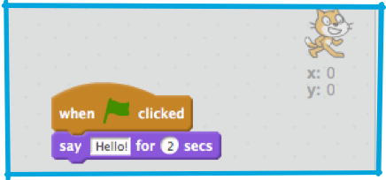

1. Эти «Суши Карточки» помогут тебе научиться создавать компьютерные программы в нашей программе “Scratch” \(произностится «скратч», т. е. царапина\). Чтобы этим заняться тебе понадобится сама программа **Scratch**!

   У тебя есть выбор: можно скачать и установить на свой компьютер с сайта [dojo.soy/downloadscratch](dojo.soy/downloadscratch) или можно работать онлайн на сайте [dojo.soy/usescratch](dojo.soy/usescratch). 
   
1. Как только ты зайдешь онлайн или установишь и запустишь Scratch, то увидишь окно как на картинке ниже.

   Экран Scratch разделен на несколько частей, которые надо будет запомнить. Они помечены на картинке. 

   * Stage - Сцена
   * Start Program – Запустить Программу
   * Stop Program – Остановить Программу
   * Current Sprite Panel – Панель Выбранного Объекта
   * Sprite List – Список Объектов
   * Code Blocks Palette – Палитра блоков с кодами

1. Вот объяснение слов с картинки:

   **Stage/Сцена**

   Это пространство на котором отображается, работает написанная тобой программка.
  * Сцена состоит из одного или нескольких слоев фона \(готового изображения или цветовой заливки и эффектов\). Можно называть этот **фон**, по-взрослому и профессиональному **background** \(произносится «бэкграунд»\). 
  * Также на сцене отображаются привязанные к ней **блоки кодов** для фона \(с этим мы разберемся чуть позже\).
   
   **Sprites/ Объекты**

   «Спрайтами» называются объекты, с которыми работаем на сцене. В Scratch объектами являются:
   
   * Изображение Объекта (персонажа) на **сцене**\stage 
   * Любые **costumes / костюмы** \(внешний вид\) объекта или персонажа
   * Любые **sounds / звуки** привязанные к объекту
   * Любые **блоки кодов** привязанные к объекту 

   **Блоки Кодов**

   Коды в Scratch представлены в виде блоков, которые можно совмещать вместе, как пазлы, создавая свою программу. На **Code Blocks Palette / Палитре блоков кодов** нужно выбрать подходящий блок и перетащить на **Current Sprite Panel/Панель Выбранного Объекта** и присоединить блоки, как пазлы, вместе.
   Имеется 10 категорий блоков, которые сгруппированы по цвету и смыслам блоков кодов \(движение, внешний вид, звуки, рисование, информация, события, контроль, реагирование, операции, больше блоков\), они находятся на верху **Code Blocks Palette / Палитры блоков кодов**.

4. Пора программировать! Возвращаемся в Scratch и кликаем на Кота Скратча в **Sprite List / Списке Объектов**. Теперь **кот** является **Current Sprite / Выбранным объектом**.
   В категории **Events / События** на **Code Blocks Palette/Палитры блоков с кодами** выбираем `”when [flag symbol] clicked”` реакцию/event, и тащим мышой блок на **Current Sprite Panel / Панель Выбранного Объекта**.  
   Go to the **Events** category in the **code blocks palette** and choose the `“when [flag symbol] clicked”` event, then drag it onto the **current sprite panel**.
   Теперь в категории **Looks / Внешний вид** на **Code Blocks Palette / Палитре блоков с кодами** выбираем тот, на котором `”say [Hello!] for [2] secs”` и тащим блок на **Current Sprite Panel / Панель Выбранного Объекта** и присоединяем его вот так: 

   Теперь жмем кнопку ((Start Program/Запустить Программу** и смотрим, что получилось!

